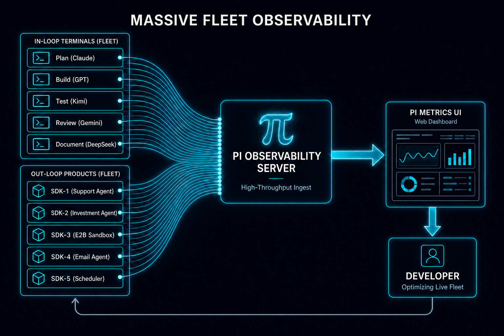
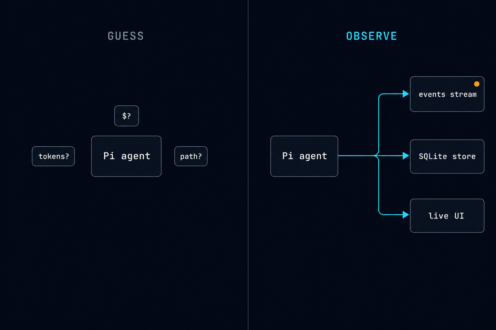
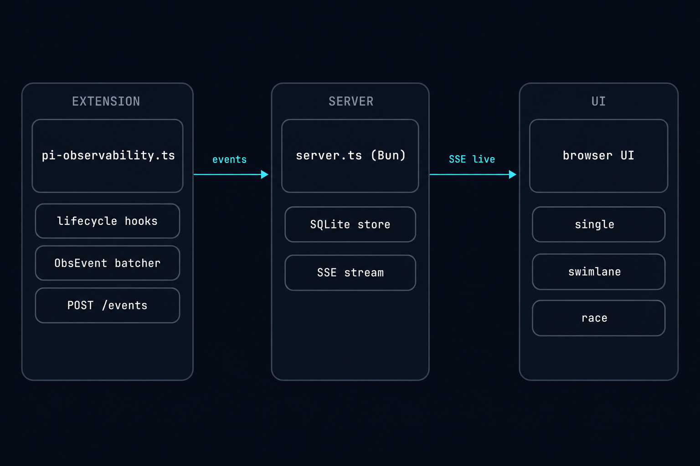
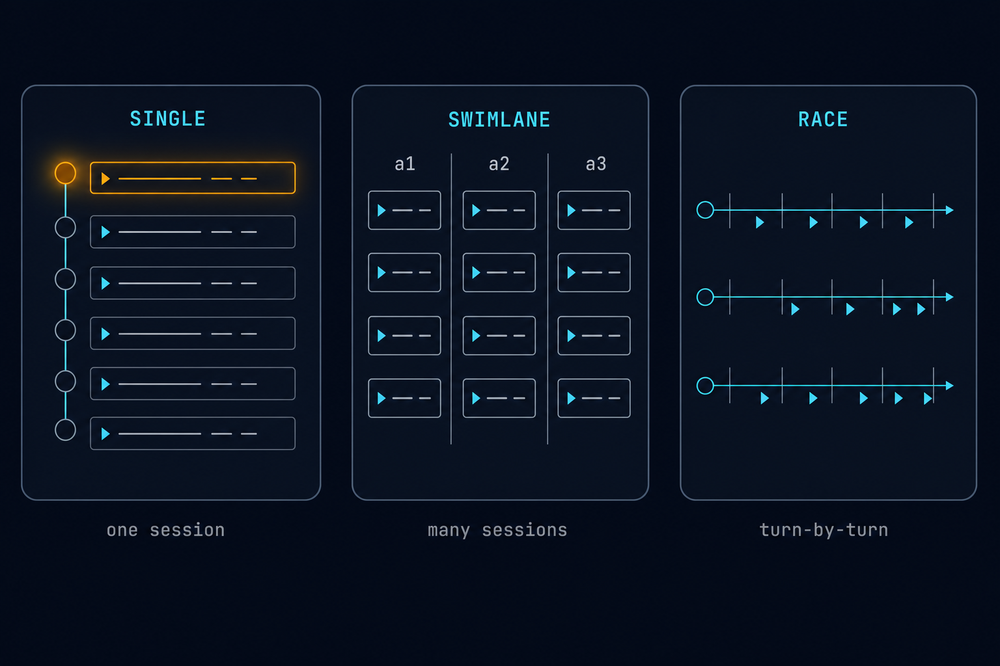
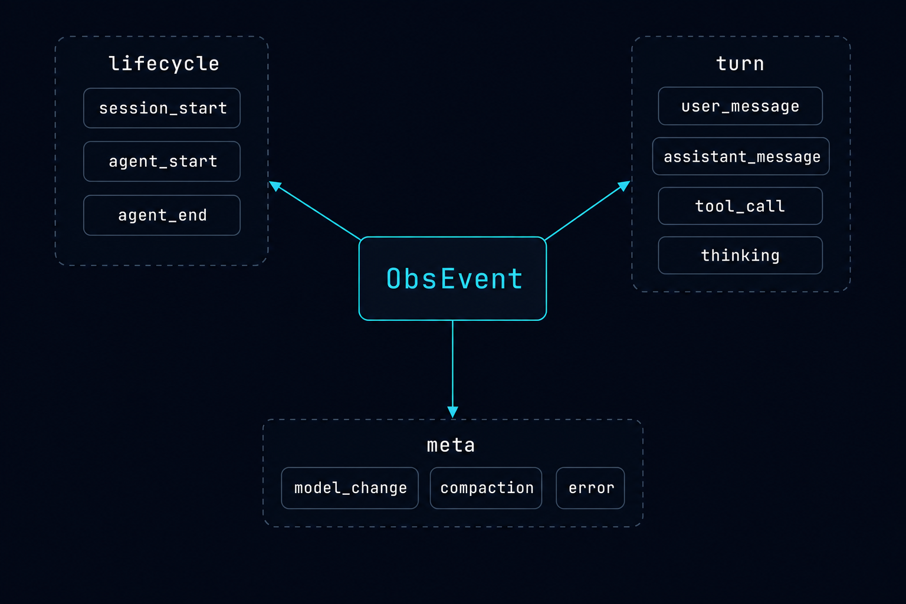
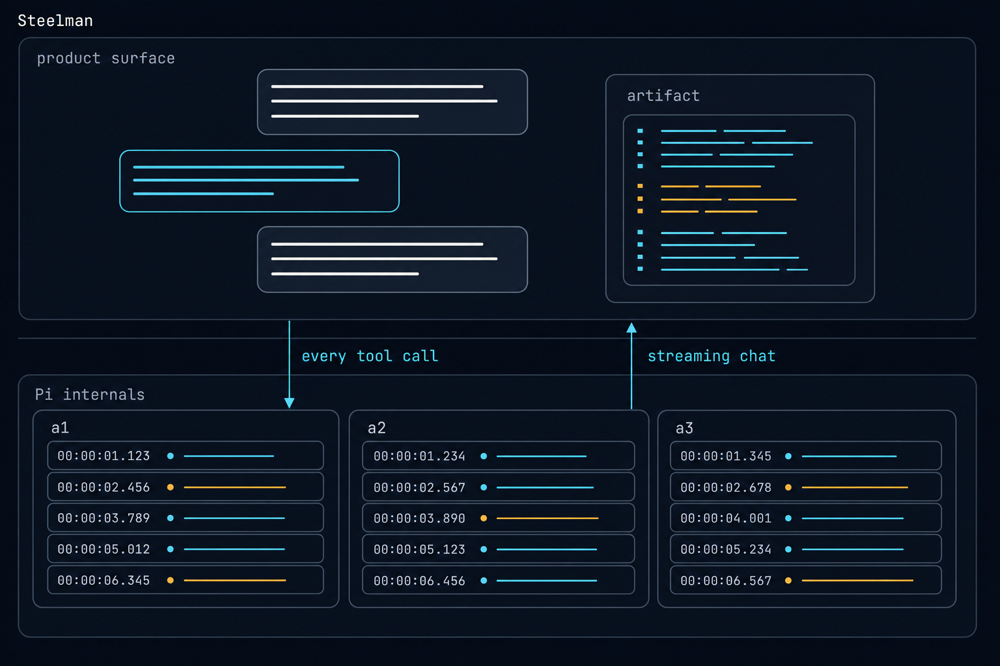

<p align="center">
  
</p>

<h1 align="center">Pi Observability</h1>

> **Stop guessing what your Pi agent is doing. Watch every turn, every tool call, every token, live.**
> A local observability stack for the [pi coding agent](https://github.com/earendil-works/pi-mono), plus a product-agent demo that proves the telemetry holds up inside a real app workflow.

📺 Watch this video to get the full breakdown of this codebase: **[Pi Observability: full breakdown](https://youtu.be/o4KZH_KSqYQ)**

<p align="center">
  
</p>

## Four Tools In One
> Four Tools. One Theme. _Agent Observability_
>
> Pi Extension, Observability Dashboard, Steelman Product Agent, Plan Prompts


**If you don't measure, you can't improve.** This repo is built around one thesis: the way to win with agents (engineering agents *and* product agents) is to measure their trade-off trifecta of **performance, speed, and cost**, because more *useful* tokens beat fewer tokens every time. You can't make that call by vibes. You make it by watching every turn, every tool call, every token. Four tools give you that:

<p align="center">
  
</p>

1. **Pi extension** (`extension/`): drop it into any Pi agent with `-e` and it streams canonical lifecycle events (every turn, tool call, model change, cost line) to the server. Zero changes to the agent itself.
2. **Observability dashboard** (`apps/observability/`): a Bun + SQLite server that ingests and persists those events, plus three browser views (**single** for one agent with full payloads, **swimlane** for N agents compared turn-by-turn, and **race** for who finished which step first) so you can A/B prompts and weigh the trifecta side by side.
3. **Steelman product agent** (`apps/steelman/`): a real product app (investment bear-thesis analysis) running on an *observed* Pi agent, proving the telemetry holds up where it matters most: a product agent executing for real users, real money, real tools.
4. **Plan prompts** (`.claude/skills/`): four spec skills that turn a prompt into an implementation plan with more *useful* tokens. The same skills your agents run under observation, so you can measure the trifecta across spec formats and pick the right one for the job:
   - `/spec`: markdown
   - `/htmlspec`: HTML
   - `/htmlvspec`: HTML + visuals (`gpt-image-2`)
   - `/vspec`: markdown + visuals (`gpt-image-2`)

The whole thing fits on `127.0.0.1` and runs from a single `just all`.

> Using Claude Code? Check out the original [Claude Code Observability](https://github.com/disler/claude-code-hooks-multi-agent-observability) codebase and [video breakdown](https://youtu.be/9ijnN985O_c)

---

## Install

### Agentic Install

```bash
just install        # runs the /install slash command in Claude Code (or Pi, or your favorite agentic coding tool)
```

The `/install` command lives at `.claude/commands/install.md` and handles toolchain checks, executable bits, and any project-specific setup.

### Manual Install

**Prereqs:** [`bun`](https://bun.sh) ≥ 1.1, [`pi`](https://github.com/earendil-works/pi-mono) on `$PATH`, [`just`](https://just.systems), `sqlite3` (system).

```bash
git clone <this-repo> pi-agent-observability     # clone the repo
cd pi-agent-observability                         # enter it
cp .env.sample .env || true                       # optional: set OBS_AUTH_TOKEN, GEMINI_API_KEY (default model), etc.
just all                                          # clears pinned ports, boots obs server + Steelman backend + Steelman web
```

Default endpoints after `just all`:

```txt
observability: http://127.0.0.1:43190/?token=devtoken
Steelman API:  http://127.0.0.1:45210
Steelman web:  http://127.0.0.1:51730
```

---

## Why this exists

<p align="center">
  
</p>

Pi runs fast and ships a single transcript. That's enough to debug a hello-world. It is **not** enough the moment you put an agent in front of real users, real money, real tools. You want to know: which model fired which tool with which args at which cost, how many retries happened, where the compaction event hit, when the branch nav cleared the context, why turn 14 spent eight seconds in `thinking`.

Without telemetry you guess. With this stack you **watch**. Three views answer three different questions:

- **Single**: what is this one agent doing right now?
- **Swimlane**: how do these N agents compare turn-by-turn?
- **Race**: which agent finished which step first, and what did they do at that step?

> *Measure to improve. The clarity of your measurement determines the clarity of the actions you can take.*

---

## How it works

<p align="center">
  
</p>

Three components, one wire format, one canonical event store:

1. **Pi observability extension**: `extension/pi-observability.ts`
   - Subscribes to every Pi lifecycle hook (`session_start`, `turn_start`, `tool_call`, `tool_result`, `model_change`, `compaction`, `branch_nav`, `error`, …).
   - Emits canonical `ObsEvent` envelopes defined in `shared/types.ts`.
   - Batches up to 50 events, applies backpressure when the queue overflows, retries on transient HTTP failure.

2. **Bun + SQLite observability server**: `apps/observability/server.ts`, `apps/observability/db.ts`
   - `POST /events`: idempotent ingest (`INSERT OR IGNORE`, `(session_id, seq)` unique index).
   - SQLite via `bun:sqlite`, WAL mode, zero migrations.
   - REST + Server-Sent Events. UI clients subscribe live and resync on reconnect.
   - Hosts the browser UI as static files, no separate frontend server.

3. **Vanilla-JS browser UI**: `apps/observability/public/`
   - `index.html` + `app.js`: single-session timeline, URL hash state, search, type filters, keyboard nav, cost/token rollups, scroll-pause autoresume.
   - `swimlane.js`: N sticky lanes side by side, live slide-in + per-event-type color pulse.
   - `race.js`: horizontal turn-grouped race view for side-by-side step comparison.

The event flows left to right: extension → server → UI. Backpressure flows the other way: the server NACKs duplicates, the extension never overwrites with stale data thanks to `COALESCE`-based UPSERT.

---

## The three views

<p align="center">
  
</p>

Each view answers a different question. Switch with the top-right toggle; the URL hash carries view + selection so the link is shareable.

| View | Question it answers | Density | When to use it |
|---|---|---|---|
| **Single** | What is *this* session doing right now? | Vertical event-per-row stream with an amber slide-in pulse on every live row | Debugging one specific agent, reading the full payload of any event, copying event JSON |
| **Swimlane** | How do these N sessions compare, turn-by-turn? | One sticky lane per session, identical row format, lanes scroll independently | Comparing a fleet, watching a swarm, A/B-ing two prompts side by side |
| **Race** | Who finished which step first, and what did they actually do at that step? | Horizontal lanes with turn boundaries as vertical ticks, events as arrows along the lane | Benchmarking, post-mortem, showing off |

All three views consume the same SSE stream from `server.ts`. The same `ObsEvent` rows render in all three, with no schema fanout.

---

## Wire format

<p align="center">
  
</p>

For the agent-agnostic wire protocol, including Hermes identity conventions, batching, auth, ordering, truncation, and compatibility guidance, see [`docs/OBSERVABILITY_PROTOCOL.md`](docs/OBSERVABILITY_PROTOCOL.md).

`shared/types.ts` is the single source of truth. Every event carries:

- **identity**: `session_id`, `cwd`, `pool`, `tags`, `agent_name`, `provider`, `model`
- **ordering**: monotonic `seq` per session (and `(session_id, seq)` is `UNIQUE` in the DB, so the extension's own bugs surface immediately)
- **payload**: a discriminated union keyed by `type`

The 16 supported event types:

```txt
session_start  session_shutdown  agent_start  agent_end
turn_start     turn_end          user_message assistant_message
thinking       tool_call         tool_result  model_change
compaction     branch_nav        error        custom
```

`payload_json` is stored as raw JSON text, with no normalized payload columns. Cost and token rollups use `json_extract(payload_json, '$.usage.total_tokens')` so the schema stays stable as event types evolve. Add a new event type, add it to the discriminated union, and ingest works the same day.

One thing the opaque payload buys you that a Pi transcript will never give you: the first `agent_start` of every session carries a **full boot snapshot** of exactly what the agent was just told. The fully assembled system prompt verbatim, plus a structured digest of `BuildSystemPromptOptions`: selected tools, prompt guidelines, `--system-prompt` / `--append-system-prompt` overrides, every context file pi loaded (path + bytes + `sha256` + full content), and every skill pi loaded (file body + `sha256` for drift detection). Uncapped, once per session. If you ever need to prove which skills made it into the system prompt for a given run (and which ones quietly didn't), that event is the receipt.

---

## Folder structure

```txt
.
├── README.md
├── LICENSE
├── justfile                          # all commands, start here
├── shared/
│   └── types.ts                      # canonical ObsEvent wire format
├── extension/
│   └── pi-observability.ts           # Pi telemetry extension
├── scripts/
│   ├── smoke-server.sh
│   ├── spawn-fleet.sh                # launch N observed Pi agents for fleet tests
│   └── validate-swimlane.ts          # observability/UI regression suite
├── apps/
│   ├── observability/                # Bun HTTP + SSE + SQLite server + static UI
│   │   ├── server.ts                 # Bun HTTP + SSE + static UI server
│   │   ├── db.ts                     # SQLite schema + prepared queries
│   │   └── public/                   # index.html · app.js · swimlane.js · race.js
│   └── steelman/                     # product-agent demo (see below)
│       ├── extension/steelman-product.ts
│       ├── server/src/server.ts
│       ├── web/src/App.vue
│       └── scripts/validate-steelman.ts
├── docs/                             # SPEC, V2/V3 status docs
└── db/                               # gitignored: obs.db + WAL files land here
```

---

## Commands

The `justfile` is the surface area. Every recipe clears its pinned port before booting, so re-running is always safe.

```bash
just all                       # boot obs + Steelman backend + Steelman web (default flow)
just all watch                 # same, with --watch on the Steelman backend
just obs                       # boot only the observability server
just steelman-server           # boot only the Steelman backend (real Pi RPC mode)
just steelman-web              # boot only the Vite frontend
just agent                     # interactive Pi agent with the observability extension attached
just backup                    # timestamped backup of db/obs.db
just validate-steelman         # validation run for the Steelman backend
just specping                  # ping the /spec skill (smoke test)
just htmlping                  # same for /htmlspec
just htmlvping                 # same for /htmlvspec
```

---

## The Steelman demo

<p align="center">
  
</p>

`apps/steelman/` is a real product app (investment-thesis analysis) built directly on top of an observed Pi agent. It exists to prove the telemetry survives a non-trivial workload, not just a hello-world.

1. Browser posts a thesis to `POST /api/runs`.
2. Backend launches `pi --mode rpc --no-builtin-tools` with **two** extensions:
   - `extension/pi-observability.ts`: the telemetry side
   - `apps/steelman/extension/steelman-product.ts`: the product tools (`steelman_research`, `steelman_emit_artifact`)
3. Product backend streams chat, tool calls, status, and artifacts to the Vue frontend over `/api/runs/:id/stream`.
4. Observability server independently captures the Pi-internal lifecycle under `pool=product-steelman`, `tag=run-<id>`, on the same database, same UI, no special-casing.

The Vue UI renders a two-pane product experience: dynamic artifacts on the left (`table`, `bar-chart`, `pie-chart`, `trend`, `scorecard`, `risk-map`, `text`, sandboxed `html`) and a streaming chat with clickable `@artifact-ref` links on the right. From the operator side, you watch the same run in the observability UI (every tool call, every model change, every cost line) without touching the product code.

A validated real run used:

```txt
provider/model: google / gemini-3.5-flash
product tools:  steelman_research, steelman_emit_artifact
artifacts:      table, bar-chart, pie-chart, trend, scorecard, risk-map, text, html
observability:  pool=product-steelman, tag=run-<id>
```

The agent's model and provider are set via `STEELMAN_AGENT_MODEL` / `STEELMAN_AGENT_MODEL_PROVIDER` (defaults `gemini-3.5-flash` / `google`). Authenticate with `GEMINI_API_KEY` or `pi /login`.

---

## More useful tokens: the planning phase

Agentic engineering has two hard constraints: **planning** and **reviewing**. The model does the work in between; you live or die by how well you frame it going in and verify it coming out. This section is about the front end of that (the plan) and the single lever that moves it most.

The lever is **more useful tokens**. Anthropic's "[unreasonable effectiveness of HTML](https://claude.com/blog/using-claude-code-the-unreasonable-effectiveness-of-html)" post landed on the same idea from the structure side: give the agent richer, more structured context and it performs better. The keyword is **useful**, not *more*. A wall of boilerplate is more tokens and worse plans. A diagram of the data model, a mocked-up component, a labeled before/after: those are tokens that change what the agent builds. You are spending context to buy precision. When you combine this with OpenAIs [GPT Image 2.0](https://openai.com/index/introducing-chatgpt-images-2-0/) model for image generation, you can generate structured, information rich, visual prompts. What i like to call: **VSpecs**.

The four `/plan` prompts are four points on the tokens-vs-precision curve, cheapest to richest:

| Prompt | Format | Tokens | Best when |
|---|---|---|---|
| `/spec` | Markdown | Lowest | Text-first work, tight context budgets, the plan is mostly prose and file lists |
| `/htmlspec` | HTML | Mid | You want structure and inline prototypes (a mocked component, a comparison table) without image cost |
| `/vspec` | Markdown + AI visuals | Mid-High | You want image-enriched plans but prefer plain markdown over HTML scaffolding (`gpt-image-2`) |
| `/htmlvspec` | HTML + AI visuals | High | UI/front-end work where a rendered diagram per section earns its tokens (`gpt-image-2`) |

Why visuals at all? Because modern models are multimodal, and an image is one of the most token-dense, lowest-ambiguity ways to communicate intent. A single diagram of "these three components, wired this way" replaces paragraphs of prose the agent would otherwise have to reconstruct, and reconstruct *its way*, not yours. The agent reads the plan and executes it, so an image embedded in the plan is an instruction with far less room to drift.

There's a real cost, and it's worth naming: visual specs are slower and more expensive to produce, and the observability stack here **does not** meter image-generation cost; that spend happens outside the Pi event stream. So the question is never "which spec is best," it's the trifecta question this whole repo is built to answer: **for this task, what's the trade-off between performance, speed, and cost?** Run the same prompt through two spec formats, watch both agents in swimlane or race, and let the turn counts, token totals, and costs decide. Measure first; then turn the winner into an eval and scale it.

---

## Improvements & Failure Modes

Things this stack does well, things it doesn't try to do, and the failure modes that are honestly worth knowing.

- **Single-host only.** SQLite + a single Bun process. No multi-node ingest, no Postgres, no S3 archive. Scale path is intentional: spin up a second instance under a different port and namespace by pool/tag.
- **Devtoken in the URL.** The default `OBS_AUTH_TOKEN=devtoken` is fine on `127.0.0.1`. Anywhere else, set a real token and don't share screenshots that include `?token=…`.
- **Extension batches up to 50.** Burst-heavy agents can lag the UI by ~1s under load. The queue drops oldest on overflow (logged, never silent). Tune `EVT_BATCH_MAX` in the extension if your workload needs it.
- **No retroactive backfill.** Events are stored on arrival. If your extension was disabled mid-run, that turn is gone; there's no Pi-session-log replayer (yet).
- **WAL files in `db/`.** `obs.db-wal` and `obs.db-shm` are real files. `.gitignore` covers them via `*.db*`. If you want a portable snapshot, `just backup` does the right thing.
- **SSE reconnect is best-effort.** On reconnect the client refetches the latest N events for every active lane and dedupes by `event_id`. If you lose the network for an hour, you get the last hour's tail, not the gap.
- **`~TPS` is an estimate.** The single-mode `~TPS` pill is `usage.output × 1000 / generation_ms` (post-prefill, real streaming rate). For batched-delta turns where `generation_ms < 50ms` it's suppressed; the math is honest, the millisecond timer is the noisy part. Renders as `—` when the window is too small to mean anything.
- **Project-local skills follow pi's convention, not Claude's.** The boot snapshot reflects whatever pi actually loaded. Pi discovers project skills at `<cwd>/.pi/skills/`, not `.claude/skills/`, so if you keep skills under `.claude/`, point pi at them explicitly with `--skill .claude/skills` or symlink `.pi/skills`. The extension faithfully reports whatever pi finds.

---

## License

MIT. See [`LICENSE`](LICENSE).

---

## Master Agentic Coding

Prepare for the future of software engineering.

Learn tactical agentic coding patterns with [Tactical Agentic Coding](https://agenticengineer.com/tactical-agentic-coding?y=piobs).

Follow the [IndyDevDan YouTube channel](https://www.youtube.com/@indydevdan) to improve your agentic coding advantage.

---

Stay Focused and Keep Building

- IndyDevDan
